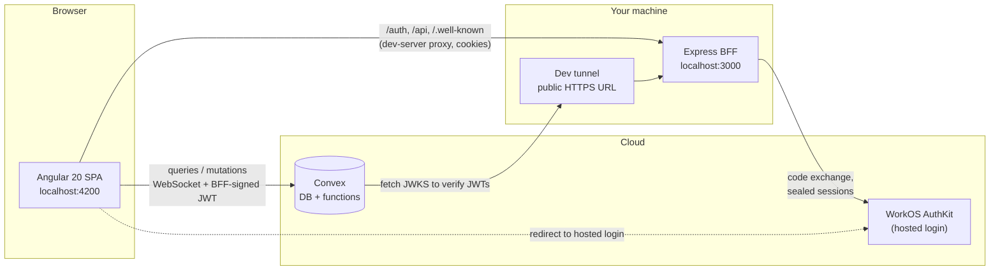
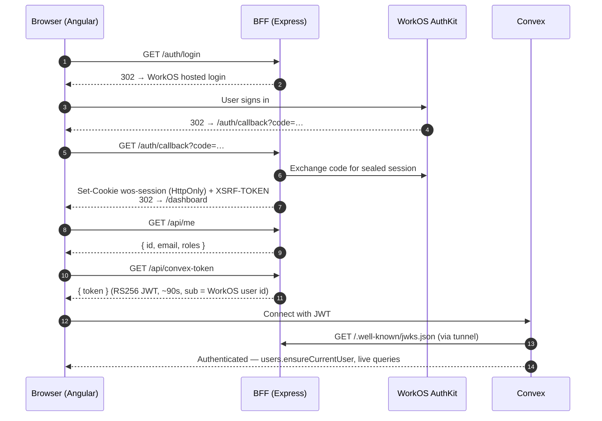

# bff-cnv

A full-stack TypeScript monorepo that pairs an **Angular 20** single-page app with an **Express Backend-for-Frontend (BFF)** and a **Convex** real-time backend, secured end-to-end with **WorkOS AuthKit**.

The BFF owns everything security-sensitive — the OAuth code exchange, an encrypted HttpOnly session cookie, CSRF protection, and signing short-lived JWTs — so the browser never handles long-lived credentials. The Angular app then uses those short-lived JWTs to talk to Convex directly over WebSocket for real-time data.

Built with [Nx](https://nx.dev) · [Angular](https://angular.dev) · [Angular Material (M3)](https://material.angular.dev) · [Tailwind CSS v4](https://tailwindcss.com) · [Express](https://expressjs.com) · [Convex](https://convex.dev) · [WorkOS AuthKit](https://workos.com/docs/authkit)

---

## Table of contents

- [Architecture](#architecture)
- [Authentication flow](#authentication-flow)
- [Repository layout](#repository-layout)
- [Getting started](#getting-started)
- [Running the app](#running-the-app)
- [Verifying the setup](#verifying-the-setup)
- [BFF API reference](#bff-api-reference)
- [Development workflow](#development-workflow)
- [Security model](#security-model)
- [Troubleshooting](#troubleshooting)

---

## Architecture



| Layer                                | Responsibility                                                                                                                                                                                         |
| ------------------------------------ | ------------------------------------------------------------------------------------------------------------------------------------------------------------------------------------------------------ |
| **Angular SPA** (`apps/ng-frontend`) | UI built only from Angular Material M3 components (see [`docs/ui.md`](docs/ui.md)), signals-based state, lazy routes, route guard for private areas. Talks to the BFF for auth and to Convex for data. |
| **Express BFF** (`apps/ng-bff`)      | WorkOS login/callback/logout, sealed session cookie, CSRF tokens, minting RS256 JWTs for Convex, and publishing the matching public key as a JWKS.                                                     |
| **Convex** (`libs/convex`)           | Database schema and server functions. Validates every request's JWT against the BFF's JWKS (`customJwt` provider).                                                                                     |
| **Dev tunnel**                       | Gives the locally running BFF a public HTTPS URL so Convex's cloud servers can fetch the JWKS. That URL is also the JWT issuer.                                                                        |

In development the Angular dev server proxies `/api`, `/auth` and `/.well-known` to the BFF ([`proxy.conf.json`](proxy.conf.json)), so the browser sees a single origin and cookies just work.

## Authentication flow



The Convex client re-requests `/api/convex-token` automatically whenever the short-lived token expires; the BFF transparently refreshes the WorkOS session when needed.

## Repository layout

```
apps/
  ng-frontend/          Angular 20 app (standalone components, signals, Material M3, Tailwind v4)
    src/app/
      core/auth/        AuthStore (session state), authGuard
      core/convex/      ConvexService (client, token wiring, live user subscription)
      layout/           App header, nav links, account menu
      pages/            home, about, blog (list/detail), dashboard (profile, my-blogs)
  ng-bff/               Express BFF
    src/app/
      routes.ts         All HTTP routes
      workos.ts         WorkOS SDK + sealed-session helpers
      jwt.ts            JWT minting + JWKS
      csrf.ts           Double-submit CSRF cookie
      config.ts         Zod-validated environment
  ng-frontend-e2e/      Playwright end-to-end tests
libs/
  convex/               Convex schema, functions (users, messages) and auth.config.ts
  shared-types/         DTOs shared between frontend and BFF
docs/
  ui.md                 UI standards (Material-only components, date formatting)
```

## Getting started

### Prerequisites

| Tool                                                                                 | Version                       | Notes                                                           |
| ------------------------------------------------------------------------------------ | ----------------------------- | --------------------------------------------------------------- |
| Node.js                                                                              | 20.19+ (22 or 24 recommended) | Required by Angular 20                                          |
| pnpm                                                                                 | 10.x                          | `corepack enable` picks up the version pinned in `package.json` |
| [devtunnel CLI](https://learn.microsoft.com/azure/developer/dev-tunnels/get-started) | latest                        | `brew install --cask devtunnel` on macOS                        |
| OpenSSL                                                                              | any                           | To generate the JWT signing key                                 |

You also need a free **[WorkOS](https://workos.com)** account (AuthKit enabled) and a **[Convex](https://convex.dev)** account.

### 1. Install dependencies

```bash
pnpm install
```

### 2. Generate the JWT signing key

The BFF signs Convex tokens with an RSA private key. `secrets/` is git-ignored.

```bash
mkdir -p secrets && openssl genpkey -algorithm RSA -pkeyopt rsa_keygen_bits:2048 -out secrets/jwt_rsa.pem
```

### 3. Create a dev tunnel (one-time)

```bash
devtunnel user login
devtunnel create bff-cnv-ng-bff -a --expiration 30d
devtunnel port create bff-cnv-ng-bff -p 3000
devtunnel host bff-cnv-ng-bff
```

Copy the `https://<id>-3000.<region>.devtunnels.ms` URL it prints — this is your **`BFF_PUBLIC_URL`**. The `-a` flag allows anonymous access, which Convex needs to fetch the JWKS. The URL stays the same every time you host this tunnel until it expires.

### 4. Configure WorkOS

In the WorkOS dashboard, add this redirect URI:

```
http://localhost:3000/auth/callback
```

### 5. Configure environment variables

Create **`.env`** in the repository root (read by the BFF):

```dotenv
# Origins
APP_URL=http://localhost:4200
BFF_URL=http://localhost:3000
BFF_PUBLIC_URL=https://<id>-3000.<region>.devtunnels.ms

# Convex JWT
CONVEX_APP_ID=bff-cnv-app
JWT_PRIVATE_KEY_FILE=./secrets/jwt_rsa.pem
JWT_EXPIRES_SECS=90

# Cookies
NODE_ENV=development
COOKIE_SAMESITE=lax

# WorkOS
WORKOS_API_KEY=sk_test_...
WORKOS_CLIENT_ID=client_...
WORKOS_COOKIE_PASSWORD=<at least 32 random characters>
```

Generate a cookie password with `openssl rand -base64 32`.

`.env.local` (also git-ignored) is created by `convex dev` in the next step and holds `CONVEX_DEPLOYMENT` and `CONVEX_URL`.

| Variable                                          | Required | Purpose                                         |
| ------------------------------------------------- | -------- | ----------------------------------------------- |
| `WORKOS_API_KEY`, `WORKOS_CLIENT_ID`              | ✅       | WorkOS credentials                              |
| `WORKOS_COOKIE_PASSWORD`                          | ✅       | Encrypts the sealed session cookie (≥ 32 chars) |
| `JWT_PRIVATE_KEY_FILE` _or_ `JWT_PRIVATE_KEY_PEM` | ✅       | RSA key used to sign Convex JWTs                |
| `BFF_PUBLIC_URL`                                  | ✅       | Public tunnel URL; used as the JWT issuer       |
| `CONVEX_APP_ID`                                   | —        | JWT audience (default `bff-cnv-app`)            |
| `APP_URL` / `BFF_URL`                             | —        | Default to `localhost:4200` / `localhost:3000`  |
| `JWT_EXPIRES_SECS`                                | —        | Token lifetime (default `90`)                   |
| `COOKIE_SAMESITE`                                 | —        | `lax` (default), `strict` or `none`             |

### 6. Connect Convex

```bash
pnpm nx run convex:dev
```

On first run this asks you to log in and pick or create a project, then writes `.env.local`. Next, tell your Convex deployment how to validate tokens — these values **must match** `.env`:

```bash
pnpm exec convex env set BFF_PUBLIC_URL https://<id>-3000.<region>.devtunnels.ms
pnpm exec convex env set CONVEX_APP_ID bff-cnv-app
```

Finally, point the frontend at your deployment by setting `NG_APP_CONVEX_URL` in [`apps/ng-frontend/src/environments/environment.ts`](apps/ng-frontend/src/environments/environment.ts) to the `CONVEX_URL` from `.env.local`.

## Running the app

Use three terminals from the repository root:

| #   | Command                         | What it runs                                             |
| --- | ------------------------------- | -------------------------------------------------------- |
| 1   | `devtunnel host bff-cnv-ng-bff` | Public HTTPS tunnel → BFF on :3000                       |
| 2   | `pnpm nx run convex:dev`        | Syncs Convex schema and functions, streams function logs |
| 3   | `pnpm dev`                      | BFF on **:3000** and Angular on **:4200**, in parallel   |

Then open **<http://localhost:4200>** and click **Sign in**.

> Prefer separate processes? Use `pnpm dev:bff` and `pnpm dev:frontend` instead of `pnpm dev`.
>
> After changing `BFF_PUBLIC_URL`, restart both the BFF and `convex dev` — the BFF reads it at startup and Convex reads it when functions are pushed.

## Verifying the setup

```bash
# BFF is up and serving its public key
curl -s http://localhost:3000/.well-known/jwks.json

# Convex can reach it through the tunnel (must return JSON, not an HTML login page)
curl -s https://<id>-3000.<region>.devtunnels.ms/.well-known/jwks.json
```

In the browser's DevTools → Network tab, after signing in you should see:

1. `GET /api/me` → `200` with your id and email
2. `GET /api/convex-token` → `200` with a `token`
3. A WebSocket connection to `<deployment>.convex.cloud`

Your name and avatar then appear in the header, loaded live from your Convex `users` record — proof that all three layers are talking to each other.

## BFF API reference

| Method | Path                     | Auth           | Description                                                                              |
| ------ | ------------------------ | -------------- | ---------------------------------------------------------------------------------------- |
| `GET`  | `/auth/login`            | —              | Redirects to WorkOS AuthKit hosted login                                                 |
| `GET`  | `/auth/callback`         | —              | Exchanges the code, sets `wos-session` + `XSRF-TOKEN` cookies, redirects to `/dashboard` |
| `POST` | `/auth/logout`           | Session + CSRF | Clears the session and redirects to the WorkOS logout URL                                |
| `GET`  | `/api/me`                | Session        | Current user `{ id, email, roles }`; refreshes the session if needed                     |
| `GET`  | `/api/convex-token`      | Session        | Mints a short-lived RS256 JWT for Convex                                                 |
| `GET`  | `/.well-known/jwks.json` | Public         | Public signing key used by Convex to verify JWTs                                         |

## Development workflow

```bash
pnpm dev              # BFF + Angular together
pnpm verify           # format check, lint, typecheck and tests — run before pushing

pnpm lint             # ESLint, all projects
pnpm typecheck        # TypeScript, all projects
pnpm test             # Jest, all projects
pnpm format           # Prettier on changed files

pnpm nx e2e ng-frontend-e2e         # Playwright end-to-end tests
pnpm nx build ng-frontend           # Production build of the SPA
pnpm nx build ng-bff                # Production build of the BFF → dist/apps/ng-bff
pnpm nx run convex:functions:check  # Type-check Convex functions
pnpm nx run convex:deploy           # Deploy Convex functions
```

Run any task for a single project with `pnpm nx <target> <project>` (e.g. `pnpm nx test ng-frontend`). `pnpm nx graph` shows how the projects depend on each other.

**UI conventions.** All UI is composed from Angular Material M3 components — no custom component library. Dates use `date-fns` in the `do MMM yyyy` format (e.g. _1st Sep 2025_). See [`docs/ui.md`](docs/ui.md) before adding UI.

## Security model

- **No tokens in the browser's storage.** The WorkOS session lives in an encrypted, `HttpOnly` cookie (`wos-session`) that JavaScript cannot read.
- **Short-lived Convex tokens.** JWTs expire after ~90 seconds and are minted on demand; the subject is the WorkOS user id.
- **CSRF protection.** State-changing BFF routes require the `X-XSRF-TOKEN` header to match the `XSRF-TOKEN` cookie (double-submit pattern).
- **Asymmetric signing.** The BFF signs with an RSA private key that never leaves the server; Convex only ever sees the public key via JWKS.
- **Authorization lives in Convex.** JWT profile claims (name, email, picture) are display hints only — roles and permissions are read from the Convex database.
- **Hardened cookies in production.** `Secure` is enabled automatically when `NODE_ENV=production`; `SameSite` is configurable.
- **Secrets stay local.** `.env`, `.env.local` and `secrets/` are git-ignored.

## Troubleshooting

| Symptom                                            | Likely cause and fix                                                                                                                                                                                                     |
| -------------------------------------------------- | ------------------------------------------------------------------------------------------------------------------------------------------------------------------------------------------------------------------------ |
| BFF exits with `Invalid environment configuration` | A required variable is missing from `.env` — the error lists which.                                                                                                                                                      |
| `EADDRINUSE` on :3000 or :4200                     | A previous dev server is still running; stop it and retry.                                                                                                                                                               |
| WorkOS shows a redirect URI error                  | Add `http://localhost:3000/auth/callback` to the allowed redirect URIs.                                                                                                                                                  |
| Signed in, but no name/avatar in the header        | Convex is rejecting the JWT. Check the tunnel is hosted, the JWKS `curl` through the tunnel returns JSON, and `BFF_PUBLIC_URL` is identical in `.env` and `convex env`. The `convex dev` terminal shows the exact error. |
| `devtunnel` reports _tunnel not found_             | Tunnels expire. Recreate it (step 3), then update `BFF_PUBLIC_URL` in `.env`, `.env.local` and `convex env set`.                                                                                                         |
| Tunnel URL returns an HTML login page              | The tunnel isn't anonymous: `devtunnel access create bff-cnv-ng-bff -p 3000 --anonymous`.                                                                                                                                |
